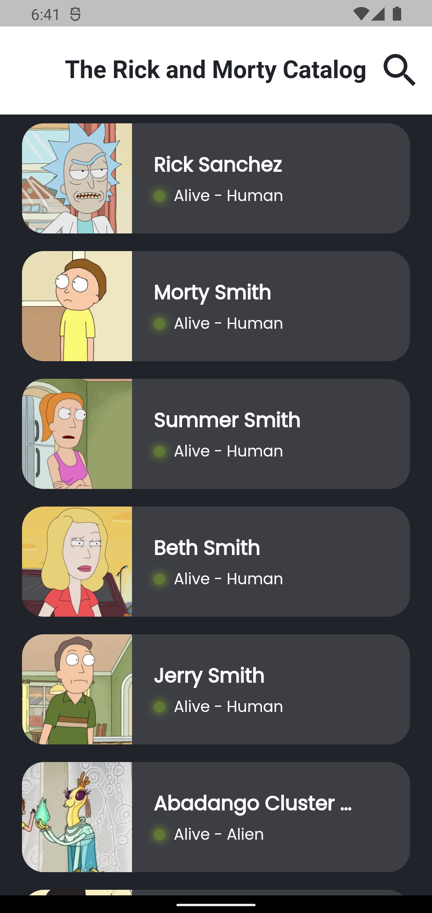
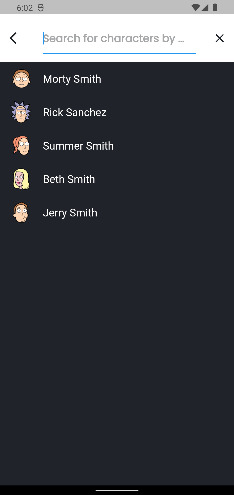
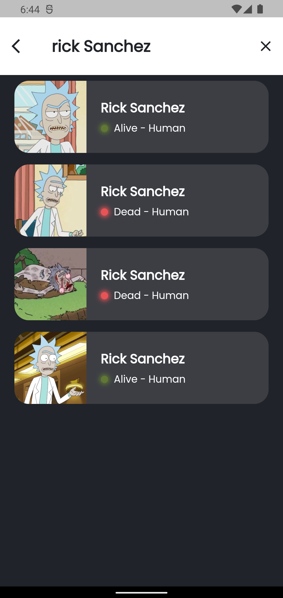
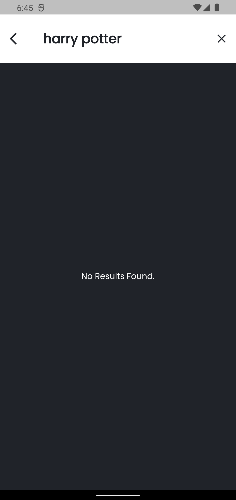

# 🥒 Rick and Morty Catalog
## Sobre o projeto

O Aplicativo consome a API [The Rick and Morty API
](https://rickandmortyapi.com) e retorna uma lista de personagens com informações sobre eles.

## Layout 

  

### Tecnologias utilizadas

* Flutter
* The Rick and Morty API
* Bloc
* Cached Network Image

### Desenvolvedora

<a href="https://www.linkedin.com/in/jusy-lopes/" > 
